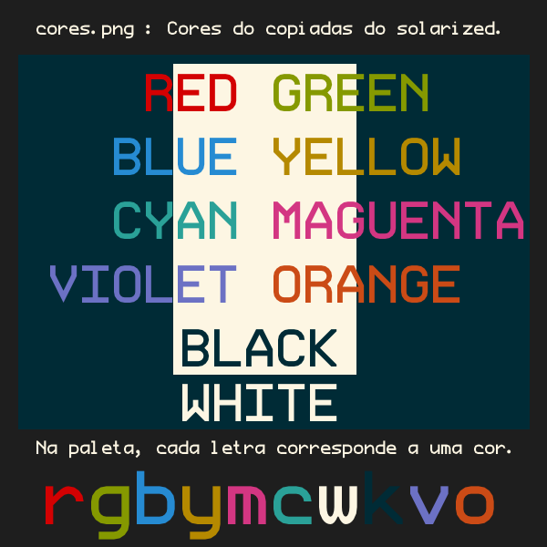
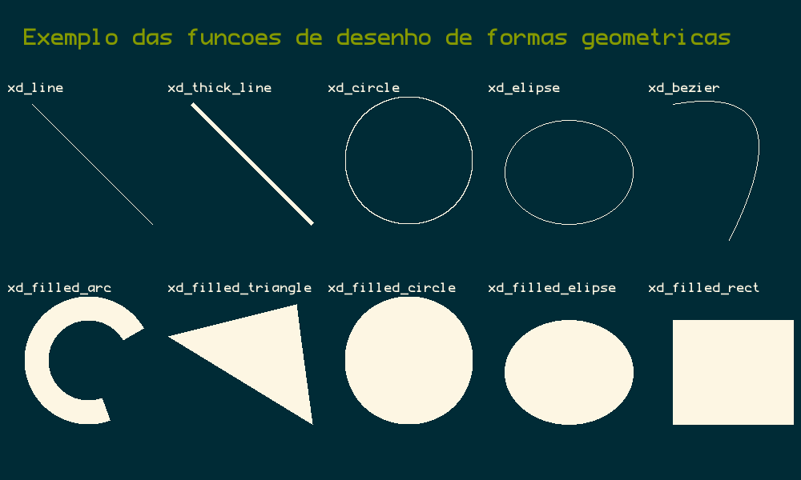

# Escrevendo, desenhando e pintando em PNGs usando C

O objetivo desse projeto é criar uma biblioteca header only para programar em C que seja capaz de criar, escrever e desenhar em pngs sem a necessidade de bibliotecas externas ou dependencias.

O código a seguir cria um bitmap, escreve um texto, pinta um círculo, salva no arquivo exemplo.png e sai. Baixe o arquivo **xpaint.h** para o seu computador e crie o arquivo **exemplo.c** com o seguinte conteúdo. 

```c
//arquivo exemplo.c
#define X_FULL
#include "xpaint.h"

int main(){
    int largura = 800, altura = 600;
    x_open(largura, altura);
    x_write(0, 30, "Pintarei um circulo vermelho em %d %d", largura/2, altura/2);
    xs_color(RED);
    xd_filled_circle(largura/2, altura/2, 200);
    x_save("exemplo");
    x_close();
    return 0;
}
```

Você pode compilar e rodar seu código apenas usando

```
gcc basico.c -o basico
./basico
```

Ele deve gerar o arquivo basico.png que se parece com isso:


Outros código de exemplo são o ecores.c, edraw.c, etexto.c.






Esta é uma biblioteca header only, ou seja, não está dividida em .c e .h. Declarações e definições estão todas no .h. 

Para carregar os cabeçalhos das funções e declarações de estruturas você pode dar o include quantas vezes quiser.

Porém você deve **uma e somente uma vez** utilizar o **#define X_FULL** **ANTES** de incluir a biblioteca **para carregar a implementação dos códigos**.

# Documentação das funções

Você pode encontrar as funções todas documentadas no arquivo xpaint.h, mas eu copio e colo abaixo.

```c
//###############################################
//######## DEFINES e TIPOS BASICOS ##############
//###############################################


//apelido para um char sem sinal
typedef unsigned char uchar;

//struct que representa uma cor RGB
typedef struct{
    uchar r;
    uchar g;
    uchar b;
} XColor;

//cria e retorna uma cor passando rgb
XColor make_color(uchar r, uchar g, uchar b);

//lista de cores default
extern XColor RED;
extern XColor GREEN;
extern XColor BLUE;
extern XColor YELLOW;
extern XColor CYAN;
extern XColor MAGENTA;
extern XColor ORANGE;
extern XColor VIOLET;
extern XColor WHITE;
extern XColor BLACK;


//###############################################
//######## ABRINDO, FECHANDO, SALVANDO ##########
//###############################################


//abre um bitmap com essas dimensões
void x_open(int width, int height);

//finaliza o bitmap liberando os recursos
void x_close();

//para salvar um png no arquivo
//não inclua a extensão .png no nome do arquivo
void x_save(const char* filename);


//###############################################
//#### PLOTANDO, ESCREVENDO, LIMPANDO ###########
//###############################################


//a funcao plot pinta o pixel usando a cor
void x_plot(int x, int y);

//a funcao write escreve um texto text, na posição px, py.
//retorna o x da posição após o último caractere escrito.
int x_write(int x, int y, const char * format, ...);

//limpa a tela inteira com a mesma cor
void x_clear(XColor color);


//###############################################
//### FUNÇÕES SET: Cor, Fonte, Paleta de Cores ##
//###############################################


//muda a cor do pincel para todas as funcoes de desenho
void xs_color(XColor color);

//define uma cor na palheta de caracteres
void xs_palette(char c, XColor color);

//mudar o tamanho da fonte em pixels
void xs_font_size(int size);

//muda a font passando o path da nova fonte
void xs_font(const char* filename);


//###############################################
//############## FUNÇÕES GET ####################
//###############################################


// retorna altura e largura do bitmap criado
int    xg_height();
int    xg_width();

//retorna a cor corrente do pincel
XColor xg_color();

//retorna a cor do pixel dessa posicao do bitmap
XColor xg_pixel(int x, int y);

//retorna uma cor dado um char. 
//os char default da paleta são rgbmcybk
//outros podem ser definidos ou redefinidor com xs_palette
XColor xg_palette(char c);


//###############################################
//############ FUNÇÕES DE DESENHO ###############
//###############################################


//Desenha as seguintes formas sem preenchimento
void xd_line(int x0, int y0, int x1, int y1);
void xd_thick_line(float ax, float ay, float bx, float by, int thickness);
void xd_circle(int centerx, int centery, int radius);
void xd_ellipse(int x0, int y0, int x1, int y1);
void xd_bezier(int x0, int y0, int x1, int y1, int x2, int y2);

//Desenha formas preenchidas (filled)
void xd_filled_arc(float centerx, float centery, int radius, int thickness, int degrees_begin, int degrees_end);
void xd_filled_triangle(float v1x, float v1y, float v2x, float v2y, float v3x, float v3y);
void xd_filled_rect(int x0, int y0, int x1, int y1);
void xd_filled_circle(int centerx, int centery, int radius);
void xd_filled_ellipse(int x0, int y0, int x1, int y1);


//###############################################
//####### ALGEBRA DE VETORES BIDIMENSIONAIS #####
//###############################################


//Define um vetor bidimensional com x e y
typedef struct{
    float x;
    float y;
} XY;

//cria e retorna um vetor
XY make_xy(float x, float y);

//retorna o tamanho de um vetor da origem
float xy_lenght(XY v);

//retorna a distancia entre dois pontos
float xy_distance(XY a, XY b);

//retorna a + b
XY xy_sum(XY a, XY b);

//retorna a - b
XY xy_sub(XY a, XY b);

//retorna (a.x * value, a.y * value)
XY xy_dot(XY a, float value);

//retorna o vetor normalizado
XY xy_normalize(XY v);

//retorna o vetor orthogonal
XY xy_ortho(XY v);


//###############################################
//############ FUNÇÕES MATEMATICAS ##############
//###############################################


/*
Essas funções foram adicionadas para que a biblioteca
xpaint não dependesse de incluir a biblioteca math.h
nos parametros de compilação com o -lm 
*/

float xm_sqrt(const float m);
float xm_pow( float x, float y );
int   xm_floor(double x);
float xm_fmod(float a, float b);
int   xm_ceil(float n);
float xm_sin(float d);
float xm_cos(float d);
float xm_acos(float x);
float xm_fabs(float f);

```
